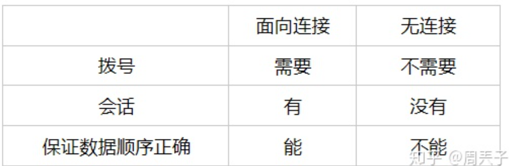

## 我的笔记

#### 面向连接与无连接的区别

面向连接需要建立连接

- step1：建立连接
- step2：连接建立成功之后传输数据（只能成功才能传输数据）
- step3：数据传输完毕后断开连接

无连接：不需要建立连接

refer：

[1](https://www.jianshu.com/p/83a31938b930)

[2上面图片](面向连接和无连接的区别？ - 周兲子的回答 - 知乎 https://www.zhihu.com/question/289026686/answer/468090045)

## 模糊的问题：

###### 七层模型、四层模型每层到底是干嘛的？

（自己写一篇文章(简要版本)）

- 五层模型

   [整体串通将7层模型非常完整的描述](https://arch-long.cn/articles/network/OSI%E6%A8%A1%E5%9E%8BTCPIP%E5%8D%8F%E8%AE%AE%E6%A0%88.html#)

   - 应用层：规定应用程序之间协议
   - 传输层：建立连接，保证应用程序之间的数据能够可靠传输(TCP/IP中也有不可靠的UDP)
   - 网络层：规划路线解析MAC地址，源主机到目的主机的IP路线
   - 数据链路层：
   - 物理层：规定物理线路、串口等等的接口信息

- TCP/IP:

   

- 传输层的双方通信节点是什么？ ------------图解TCPIP

建立连接用于保证可靠传输

- 网络层：确定目的主机的网络位置，并规划到达目的主机的路线
- 传输层：在网络层规划好的路线基础上来传输数据，并保证数据可靠

#### OSI七层模型&TCPIP模型

> 参考至图解TCPIP书籍

