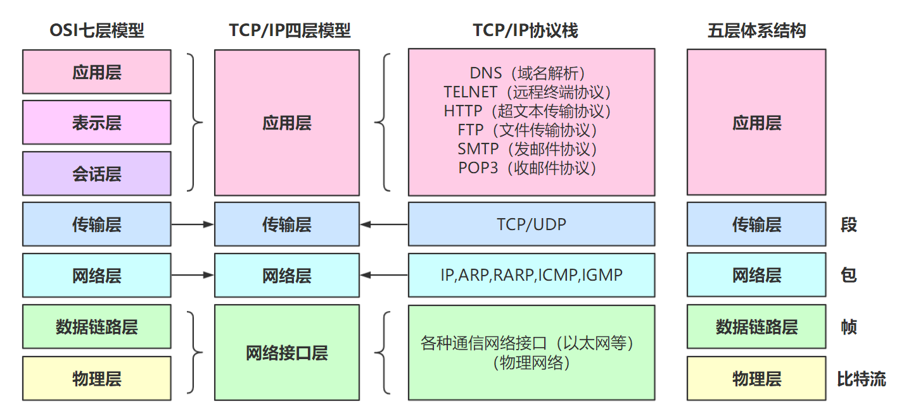
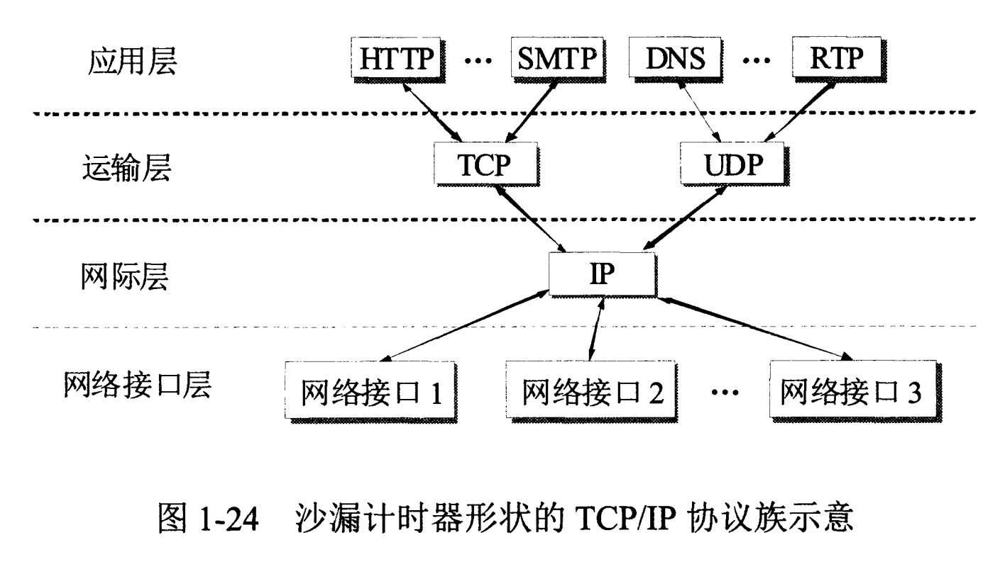
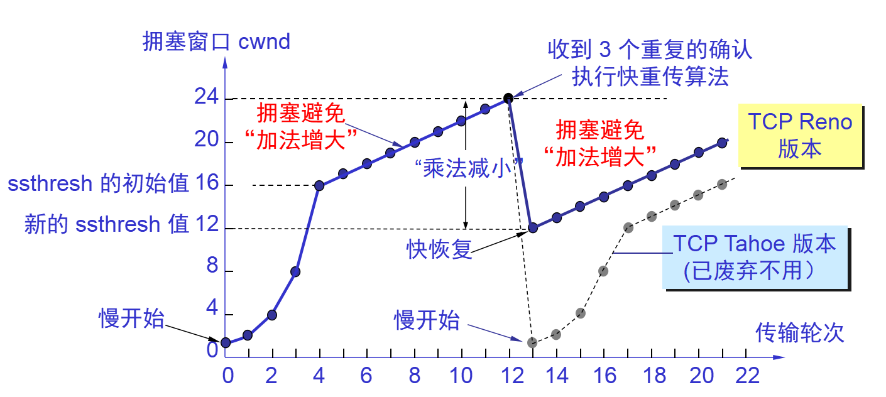
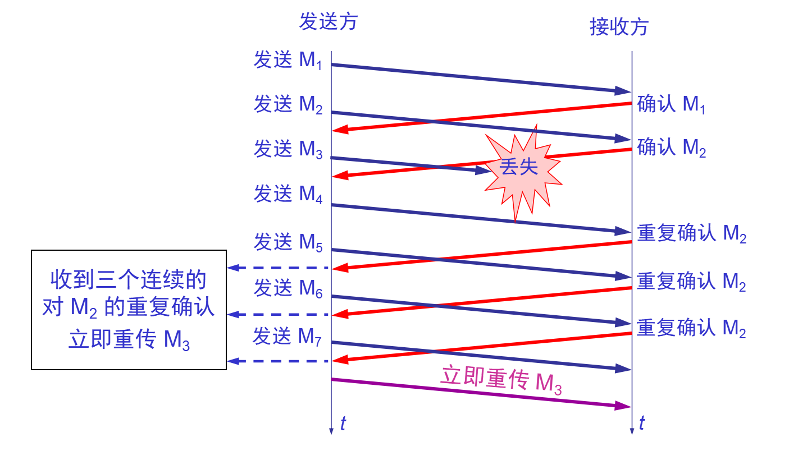

[资料来源](https://github.com/frank-lam/fullstack-tutorial/blob/master/notes/%E8%AE%A1%E7%AE%97%E6%9C%BA%E7%BD%91%E7%BB%9C.md)

<!-- TOC -->

- [前言](#前言)
- [第一部分：传输层](#第一部分传输层)
    - [1. 说一下OSI七层模型  TCP/IP四层模型  五层协议](#1-说一下osi七层模型--tcpip四层模型--五层协议)
        - [（1）五层协议](#1五层协议)
        - [（2）ISO七层模型中表示层和会话层功能是什么？](#2iso七层模型中表示层和会话层功能是什么)
        - [（3）数据在各层之间的传递过程](#3数据在各层之间的传递过程)
        - [（4）TCP/IP四层模型](#4tcpip四层模型)
    - [2. TCP报头格式和UDP报头格式](#2-tcp报头格式和udp报头格式)
        - [（1）UDP 和 TCP 的特点](#1udp-和-tcp-的特点)
        - [（2）UDP 首部格式](#2udp-首部格式)
        - [（3）TCP 首部格式](#3tcp-首部格式)
    - [3. TCP三次握手？那四次挥手呢？如何保障可靠传输](#3-tcp三次握手那四次挥手呢如何保障可靠传输)
        - [（1）三次握手](#1三次握手)
        - [（2）为什么TCP连接需要三次握手，两次不可以吗，为什么](#2为什么tcp连接需要三次握手两次不可以吗为什么)
        - [（3）四次挥手](#3四次挥手)
        - [（4）四次挥手的原因](#4四次挥手的原因)
        - [（5）TIME_WAIT](#5time_wait)
        - [（6）如何保证可靠传输](#6如何保证可靠传输)
        - [（7）TCP连接状态？](#7tcp连接状态)
        - [（8）TCP和HTTP](#8tcp和http)
    - [4. TCP连接中如果断电怎么办](#4-tcp连接中如果断电怎么办)
    - [5. TCP和UDP区别？如何改进TCP](#5-tcp和udp区别如何改进tcp)
    - [6. TCP滑动窗口](#6-tcp滑动窗口)
    - [7. TCP流量控制](#7-tcp流量控制)
    - [8. TCP拥塞处理（Congestion Handling）](#8-tcp拥塞处理congestion-handling)
        - [（1）慢开始与拥塞避免](#1慢开始与拥塞避免)
        - [（2）快重传与快恢复](#2快重传与快恢复)
        - [（3）发送窗口的上限值](#3发送窗口的上限值)
    - [9. 如何区分流量控制和拥塞控制](#9-如何区分流量控制和拥塞控制)
    - [10. 解释RTO，RTT和超时重传](#10-解释rtortt和超时重传)
    - [11. 停止等待和超时重传](#11-停止等待和超时重传)
    - [12. 从输入网址到获得页面的网络请求过程](#12-从输入网址到获得页面的网络请求过程)

<!-- /TOC -->
# 前言

本文将总结后台开发中的核心网络知识。主要围绕网络层、传输层、应用层，核心为 TCP 和 HTTP 两部分。

# 第一部分：传输层

## 1. 说一下OSI七层模型  TCP/IP四层模型  五层协议

### （1）五层协议

​	

- **应用层** ：(应用程序间)提供**用户接口**，特指能够发起网络流量的程序，比如客户端程序：QQ，MSN，浏览器等；服务器程序：web服务器，邮件服务器，流媒体服务器等等。数据单位为报文。

   
 

- ###### **传输层** ：提供的是**进程间**的通用数据传输服务。
  
  由于应用层协议很多，**定义通用的运输层协议就可以支持不断增多的应用层协议**。运输层包括两种协议：
  
  - 传输控制协议 TCP，提供面向连接、可靠的数据传输服务，数据单位为**报文段**；
  - 用户数据报协议 UDP，提供无连接、尽最大努力的数据传输服务，数据单位为**用户数据报**。
  - TCP 主要提供完整性服务，UDP 主要提供及时性服务。
  
- **网络层** ：[主机之间传递网络，规划IP路线]为**主机间**提供数据传输服务，而运输层协议是为主机中的进程提供服务。网络层把运输层传递下来的报文段或者用户数据报**封装成分组**【数据包】。（负责选择最佳路径  规划IP地址）
  
  - 路由器查看数据包目标IP地址，根据路由表为数据包选择路径。路由表中的类目可以人工添加（静态路由）也可以动态生成（动态路由）。
  
- **数据链路层** ：不同的网络类型，发送数据的机制不同，数据链路层就是将数据包封装成能够**在不同的网络传输的帧**。能够进行差错检验，但不纠错，监测处错误丢掉该帧。
  
  - 帧的开始和结束，透明传输，差错校验
  
- **物理层** ：物理层解决如何在连接各种计算机的传输媒体上传输数据比特流，而不是指具体的传输媒体。物理层的主要任务描述为：确定与传输媒体的接口的一些特性，即：
  - 机械特性：例接口形状，大小，引线数目
  - 电气特性：例规定电压范围 ( -5V 到 +5V )
  - 功能特性：例规定 -5V 表示 0，＋5V 表示 1
  - 过程特性：也称规程特性，规定建立连接时各个相关部件的工作步骤

### （2）ISO七层模型中表示层和会话层功能是什么？

- **表示层** ：数据压缩、加密以及数据描述。这使得应用程序不必担心在各台主机中表示/存储的内部格式（二进制、ASCII，比如乱码）不同的问题。 

- **会话层** ：建立会话，如session认证、断点续传。通信的应用程序之间建立、维护和释放面向用户的连接。通信的应用程序之间建立会话，需要传输层建立1个或多个连接。（...后台运行的木马，netstat -n）

- 说明：五层协议没有表示层和会话层，而是将这些功能留给应用程序开发者处理。

### （3）数据在各层之间的传递过程

　　在向下的过程中，需要添加下层协议所需要的首部或者尾部，而在向上的过程中不断拆开首部和尾部。

1. 路由器只有下面三层协议，因为路由器位于网络核心中，不需要为进程或者应用程序提供服务，因此也就不需要运输层和应用层。

2. 交换机只有下面两层协议

   
  
 

  
 

  
 

### （4）TCP/IP四层模型

它只有四层，相当于五层协议中**数据链路层和物理层合并为网络接口层**。

现在的 TCP/IP 体系结构不严格遵循 OSI 分层概念，应用层可能会直接使用 IP 层或者网络接口层。

  
 

TCP/IP 协议族是一种沙漏形状，中间小两边大，IP 协议在其中占用举足轻重的地位。 

  
 

参考资料：

- [OSI模型、TCP/IP协议栈](https://arch-long.cn/articles/network/OSI%E6%A8%A1%E5%9E%8BTCPIP%E5%8D%8F%E8%AE%AE%E6%A0%88.html)

## 2. TCP报头格式和UDP报头格式

网络层只把分组发送到目的主机，但是真正通信的并不是主机而是主机中的进程。运输层提供了进程间的逻辑通信，运输层向高层用户屏蔽了下面网络层的核心细节，使应用程序看起来像是在两个运输层实体之间有一条端到端的逻辑通信信道。

### （1）UDP 和 TCP 的特点

- **用户数据报协议 UDP**（User Datagram Protocol）是无连接的，尽最大可能交付，没有拥塞控制，面向报文（对于应用程序传下来的报文不合并也不拆分，只是添加 UDP 首部），支持一对一、一对多、多对一和多对多的交互通信。例如：视频传输、实时通信
- **传输控制协议 TCP**（Transmission Control Protocol）是面向连接的，提供可靠交付，有流量控制，拥塞控制，提供全双工通信，面向字节流（把应用层传下来的报文看成字节流，把字节流组织成大小不等的数据块），每一条 TCP 连接只能是点对点的（一对一）。

### （2）UDP 首部格式

  
 

首部字段只有 8 个字节，包括源端口、目的端口、长度、检验和。12 字节的伪首部是为了计算检验和临时添加的。

### （3）TCP 首部格式

  
 

- **序号 seq** ：用于对字节流进行编号，例如序号为 301，表示第一个字节的编号为 301，如果携带的数据长度为 100 字节，那么下一个报文段的序号应为 401。[301,400]为序号301的数据长度，下一个则为401
- **确认号 ack** ：期望收到的下一个报文段的序号。例如 B 正确收到 A 发送来的一个报文段，序号为 501，携带的数据长度为 200 字节，因此 B 期望下一个报文段的序号为 701，B 发送给 A 的确认报文段中确认号就为 701。
- **数据偏移** ：指的是数据部分距离报文段起始处的偏移量，实际上指的是首部的长度。
- **确认 ACK** ：当 ACK=1 时确认号字段有效，否则无效。TCP 规定，在连接建立后所有传送的报文段都必须把 ACK 置 1。
- **同步 SYN** ：在连接建立时用来同步序号。当 SYN=1，ACK=0 时表示这是一个连接请求报文段。若对方同意建立连接，则响应报文中 SYN=1，ACK=1。
- **终止 FIN** ：用来释放一个连接，当 FIN=1 时，表示此报文段的发送方的数据已发送完毕，并要求释放连接。
- **窗口** ：窗口值作为接收方让发送方设置其发送窗口的依据。之所以要有这个限制，是因为接收方的数据缓存空间是有限的。

参考资料：

- [计算机网络-运输层-笔记 | SamanthaChen's Blog](https://samanthachen.github.io/2016/08/15/%E8%AE%A1%E7%AE%97%E6%9C%BA%E7%BD%91%E7%BB%9C3/)

## 3. TCP三次握手？那四次挥手呢？如何保障可靠传输

### （1）三次握手

  
 

**假设 A 为客户端，B 为服务器端。**

- 首先 B 处于 LISTEN（监听）状态，等待客户的连接请求。
- A 向 B 发送连接请求报文段，SYN=1，ACK=0，选择一个初始的序号 seq = x。
- B 收到连接请求报文段，如果同意建立连接，则向 A 发送连接确认报文段，SYN=1，ACK=1，确认号为 x+1，同时也选择一个初始的序号 seq = y。
- A 收到 B 的连接确认报文段后，还要向 B 发出确认，确认号为 ack = y+1，序号为 seq = x+1。
- A 的 TCP 通知上层应用进程，连接已经建立。
- B 收到 A 的确认后，连接建立。
- B 的 TCP 收到主机 A 的确认后，也通知其上层应用进程：TCP 连接已经建立。

### （2）为什么TCP连接需要三次握手，两次不可以吗，为什么

**为了防止已失效的连接请求报文段突然又传送到了服务端，占用服务器资源。 （假设主机A为客户端，主机B为服务器端）**

现假定出现一种异常情况，即A发出的第一个连接请求报文段并没有丢失，而是在某些网络节点长时间滞留了，以致延误到连接释放以后的某个时间才到B。本来这是一个已失效的报文段。但是B收到此失效的连接请求报文段后，就误认为是A有发出一次新的连接请求。于是就向A发出确认报文段，同意建立连接。假定不采用三次握手，那么只要B发出确认，新的连接就建立了。

由于现在A并没有发出建立连接的请求，因此不会理睬B的确认，也不会向B发送数据。但B却以为新的运输连接已经建立了，并一直等待A发来数据。B的许多资源就这样白白浪费了。

采用三次握手的办法可以防止上述现象的发生。例如在刚才的情况下，A不会向B的确认发出确认。B由于收不到确认，就知道A并没有要求建立连接。

### （3）四次挥手

  
 

数据传输结束后，通信的双方都可释放连接。现在 A 的应用进程先向其 TCP 发出连接释放报文段，并停止再发送数据，主动关闭 TCP连接。

- A 把连接释放报文段首部的 FIN = 1，其序号 seq = u，等待 B 的确认。
- B 发出确认，确认号 ack = u+1，而这个报文段自己的序号 seq = v。（TCP 服务器进程通知高层应用进程）
- 从 A 到 B 这个方向的连接就释放了，TCP 连接处于半关闭状态。A 不能向 B 发送数据；B 若发送数据，A 仍要接收。
- 当 B 不再需要连接时，发送连接释放请求报文段，FIN=1。
- A 收到后发出确认，进入 TIME-WAIT 状态，等待 2 MSL（2*2 = 4 mins）时间后释放连接。
- B 收到 A 的确认后释放连接。

### （4）四次挥手的原因

客户端发送了 FIN 连接释放报文之后，服务器收到了这个报文，就进入了 CLOSE-WAIT 状态。这个状态是为了让服务器端发送还未传送完毕的数据，传送完毕之后，服务器会发送 FIN 连接释放报文。

### （5）TIME_WAIT

> MSL是Maximum Segment Lifetime英文的缩写，中文可以译为 “报文最大生存时间”，他是任何报文在网络上存在的最长时间，超过这个时间报文将被丢弃。2MSL = 2*2mins = 4mins

客户端接收到服务器端的 FIN 报文后进入此状态，此时并不是直接进入 CLOSED 状态，还需要等待一个时间计时器设置的时间 2MSL。这么做有两个理由：

- 确保最后一个确认报文段能够到达。如果 B 没收到 A 发送来的确认报文段，那么就会重新发送连接释放请求报文段，A 等待一段时间就是为了处理这种情况的发生。
- 等待一段时间是为了让本连接持续时间内所产生的所有报文段都从网络中消失，使得下一个新的连接不会出现旧的连接请求报文段。

### （6）如何保证可靠传输

**【详细请查阅】：《计算机网络原理 创新教程》P356——8.4节，可靠传输**

- 应用数据被分割成TCP认为最适合发送的数据块。 
- **超时重传**：当TCP发出一个段后，它启动一个定时器，等待目的端确认收到这个报文段。如果不能及时收到一个确认，将重发这个报文段。
- TCP给发送的每一个包进行编号，接收方对数据包进行排序，把有序数据传送给应用层。 
- **校验和**：TCP将保持它首部和数据的检验和。这是一个端到端的检验和，目的是检测数据在传输过程中的任何变化。如果收到段的检验和有差错，TCP将丢弃这个报文段和不确认收到此报文段。
- TCP的接收端会丢弃重复的数据。
- **流量控制**：TCP连接的每一方都有固定大小的缓冲空间，TCP的接收端只允许发送端发送接收端缓冲区能接纳的我数据。当接收方来不及处理发送方的数据，能提示发送方降低发送的速率，防止包丢失。TCP使用的流量控制协议是可变大小的滑动窗口协议。
- **拥塞控制**：当网络拥塞时，减少数据的发送。 

### （7）TCP连接状态？ 

- CLOSED：初始状态。
- LISTEN：服务器处于监听状态。
- SYN_SEND：客户端socket执行CONNECT连接，发送SYN包，进入此状态。
- SYN_RECV：服务端收到SYN包并发送服务端SYN包，进入此状态。
- ESTABLISH：表示连接建立。客户端发送了最后一个ACK包后进入此状态，服务端接收到ACK包后进入此状态。
- FIN_WAIT_1：终止连接的一方（通常是客户机）发送了FIN报文后进入。等待对方FIN。
- CLOSE_WAIT：（假设服务器）接收到客户机FIN包之后等待关闭的阶段。在接收到对方的FIN包之后，自然是需要立即回复ACK包的，表示已经知道断开请求。但是本方是否立即断开连接（发送FIN包）取决于是否还有数据需要发送给客户端，若有，则在发送FIN包之前均为此状态。
- FIN_WAIT_2：此时是半连接状态，即有一方要求关闭连接，等待另一方关闭。客户端接收到服务器的ACK包，但并没有立即接收到服务端的FIN包，进入FIN_WAIT_2状态。
- LAST_ACK：服务端发动最后的FIN包，等待最后的客户端ACK响应，进入此状态。
- TIME_WAIT：客户端收到服务端的FIN包，并立即发出ACK包做最后的确认，在此之后的2MSL时间称为TIME_WAIT状态。

### （8）TCP和HTTP

 
 

## 4. TCP连接中如果断电怎么办

TCP新手误区--心跳的意义 - CSDN博客
https://blog.csdn.net/bjrxyz/article/details/71076442

## 5. TCP和UDP区别？如何改进TCP

- TCP和UDP区别 
  - UDP 是无连接的，即发送数据之前不需要建立连接。 
  - UDP 使用尽最大努力交付，即不保证可靠交付，同时也不使用拥塞控制。 
  - UDP 是面向报文的。UDP 没有拥塞控制，很适合多媒体通信的要求。 
  - UDP 支持一对一、一对多、多对一和多对多的交互通信。 
  - UDP 的首部开销小，只有 8 个字节。 
  - TCP 是面向连接的运输层协议。 
  - 每一条 TCP 连接只能有两个端点(endpoint)，每一条 TCP 连接只能是点对点的（一对一）。 
  - TCP 提供可靠交付的服务。 
  - TCP 提供全双工通信。 
  - TCP是面向字节流。   
  - 首部最低20个字节。 
- TCP加快传输效率的方法 
  - 采取一块确认的机制 

## 6. TCP滑动窗口

  
 

窗口是缓存的一部分，用来暂时存放字节流。发送方和接收方各有一个窗口，**接收方通过 TCP 报文段中的窗口字段告诉发送方自己的窗口大小，发送方根据这个值和其它信息设置自己的窗口大小**。

发送窗口内的字节都允许被发送，接收窗口内的字节都允许被接收。如果发送窗口左部的字节已经发送并且收到了确认，那么就将发送窗口向右滑动一定距离，直到左部第一个字节不是已发送并且已确认的状态；接收窗口的滑动类似，接收窗口左部字节已经发送确认并交付主机，就向右滑动接收窗口。

接收窗口只会对窗口内最后一个按序到达的字节进行确认，例如接收窗口已经收到的字节为 {31, 34, 35}，其中 {31} 按序到达，而 {32, 33} 就不是，因此只对字节 31 进行确认。发送方得到一个字节的确认之后，就知道这个字节之前的所有字节都已经被接收。

**以下进行滑动窗口模拟**

在 TCP 中，**滑动窗口是为了实现流量控制**。如果对方发送数据过快，接收方就来不及接收，接收方就需要通告对方，减慢数据的发送。 

 
 

- **发送方接收到了对方发来的报文 ack = 33, win = 10，知道对方收到了 33 号前的数据**，现在期望接收 [33, 43) 号数据。发送方连续发送了 4 个报文段假设为 A, B, C, D, 分别携带 [33, 35), [35, 36), [36, 38), [38, 41) 号数据。
- 接收方接收到了报文段 A, C，但是没收到 B 和 D，也就是只收到了 [33, 35) 和 [36, 38) 号数据。接收方发送回对报文段 A 的确认：ack = 35, win = 10。
- 发送方收到了 ack = 35, win = 10，对方期望接收 [35, 45) 号数据。接着发送了一个报文段 E，它携带了 [41, 44) 号数据。
- 接收方接收到了报文段 B: [35, 36), D:[38, 41)，接收方发送对 D 的确认：ack = 41, win = 10. （这是一个累积确认）
- 发送方收到了 ack = 41, win = 10，对方期望接收 [41, 51) 号数据。
- ……
- 需要注意的是，接收方接收 tcp 报文的顺序是不确定的，并非是一定先收到 35 再收到 36，也可能是先收到 36，37，再收到 35.

 

参考资料：

- [20-TCP 协议（滑动窗口——基础） - CSDN博客](https://blog.csdn.net/q1007729991/article/details/70142341)
- [21-TCP 协议（滑动窗口——抓包分析） - CSDN博客](https://blog.csdn.net/q1007729991/article/details/70143062)
- [TCP 的那些事儿（下） | | 酷 壳 - CoolShell](https://coolshell.cn/articles/11609.html)

## 7. TCP流量控制

流量控制是为了控制发送方发送速率，保证接收方来得及接收。

接收方发送的确认报文中的窗口字段可以用来控制发送方窗口大小，从而影响发送方的发送速率。将窗口字段设置为 0，则发送方不能发送数据。

## 8. TCP拥塞处理（Congestion Handling）

拥塞控制的一般原理

- 在某段时间，若对网络中某资源的需求超过了该资源所能提供的可用部分，网络的性能就要变坏——产生拥塞(congestion)。
- 出现资源拥塞的条件：对资源需求的总和 > 可用资源
- 若网络中有许多资源同时产生拥塞，网络的性能就要明显变坏，整个网络的吞吐量将随输入负荷的增大而下降。  

如果网络出现拥塞，分组将会丢失，此时发送方会继续重传，从而导致网络拥塞程度更高。因此当出现拥塞时，应当控制发送方的速率。这一点和流量控制很像，但是出发点不同。流量控制是为了让接收方能来得及接收，而拥塞控制是为了降低整个网络的拥塞程度。

  
 

 

TCP 主要通过四种算法来进行拥塞控制：慢开始、拥塞避免、快重传、快恢复。

发送方需要维护一个叫做拥塞窗口（cwnd）的状态变量，注意拥塞窗口与发送方窗口的区别：拥塞窗口只是一个状态变量，实际决定发送方能发送多少数据的是发送方窗口。

为了便于讨论，做如下假设：

- 接收方有足够大的接收缓存，因此不会发生流量控制；
- 虽然 TCP 的窗口基于字节，但是这里设窗口的大小单位为报文段。

 
  
 

### （1）慢开始与拥塞避免

　　发送的最初执行慢开始，令 cwnd=1，发送方只能发送 1 个报文段；当收到确认后，将 cwnd 加倍，因此之后发送方能够发送的报文段数量为：2、4、8 ...

　　注意到慢开始每个轮次都将 cwnd 加倍，这样会让 cwnd 增长速度非常快，从而使得发送方发送的速度增长速度过快，网络拥塞的可能也就更高。设置一个慢启动阈值 ssthresh，当 cwnd >= ssthresh 时，进入拥塞避免，每个轮次只将 cwnd 加 1。

　　如果出现了超时，则令 ssthresh = cwnd/2，然后重新执行慢开始。

### （2）快重传与快恢复

　　在接收方，要求每次接收到报文段都应该对最后一个已收到的有序报文段进行确认。例如已经接收到 M1 和 M2，此时收到 M4，应当发送对 M2 的确认。

　　在发送方，如果收到三个重复确认，那么可以知道下一个报文段丢失，此时执行快重传，立即重传下一个报文段。例如收到三个 M2，则 M3 丢失，立即重传 M3。

　　在这种情况下，只是丢失个别报文段，而不是网络拥塞。因此执行快恢复，令 ssthresh = cwnd/2 ，cwnd = ssthresh，注意到此时直接进入拥塞避免。慢开始和快恢复的快慢指的是 cwnd 的设定值，而不是 cwnd 的增长速率。慢开始 cwnd 设定为 1，而快恢复 cwnd 设定为 ssthresh。

  
 

### （3）发送窗口的上限值

　　发送方的发送窗口的上限值应当取为接收方窗口 rwnd 和拥塞窗口 cwnd 这两个变量中较小的一个，即应按以下公式确定：

- 发送窗口的上限值 =  Min {rwnd, cwnd}
  - 当 rwnd < cwnd 时，是接收方的接收能力限制发送窗口的最大值。
  - 当 cwnd < rwnd 时，则是网络的拥塞限制发送窗口的最大值。 

## 9. 如何区分流量控制和拥塞控制 

- 拥塞控制所要做的都有一个前提，就是网络能够承受现有的网络负荷。
- 拥塞控制是一个全局性的过程，涉及到所有的主机、所有的路由器，以及与降低网络传输性能有关的所有因素。
- 流量控制往往指在给定的发送端和接收端之间的点对点通信量的控制。
- 流量控制所要做的就是抑制发送端发送数据的速率，以便使接收端来得及接收。 

- 流量控制属于通信双方协商；拥塞控制涉及通信链路全局。

- 流量控制需要通信双方各维护一个发送窗、一个接收窗，对任意一方，接收窗大小由自身决定，发送窗大小由接收方响应的TCP报文段中窗口值确定；拥塞控制的拥塞窗口大小变化由试探性发送一定数据量数据探查网络状况后而自适应调整。

- 实际最终发送窗口 = min{流控发送窗口，拥塞窗口}。

## 10. 解释RTO，RTT和超时重传 

- **超时重传**：发送端发送报文后若长时间未收到确认的报文则需要重发该报文。可能有以下几种情况：
  - 发送的数据没能到达接收端，所以对方没有响应。
  - 接收端接收到数据，但是ACK报文在返回过程中丢失。
  - 接收端拒绝或丢弃数据。
- **RTO**：从上一次发送数据，因为长期没有收到ACK响应，到下一次重发之间的时间。就是重传间隔。
  - 通常每次重传RTO是前一次重传间隔的两倍，计量单位通常是RTT。例：1RTT，2RTT，4RTT，8RTT......
  - 重传次数到达上限之后停止重传。
- **RTT**：数据从发送到接收到对方响应之间的时间间隔，即数据报在网络中一个往返用时。大小不稳定。

## 11. 停止等待和超时重传

## 12. 从输入网址到获得页面的网络请求过程

- 查询 DNS
  - 浏览器搜索自身的DNS缓存
  - 搜索操作系统的DNS缓存，本地host文件查询
  - 如果 DNS 服务器和我们的主机在同一个子网内，系统会按照下面的 ARP 过程对 DNS 服务器进行 ARP查询
  - 如果 DNS 服务器和我们的主机在不同的子网，系统会按照下面的 ARP 过程对默认网关进行查询
- 浏览器获得域名对应的IP地址后，发起HTTP三次握手

- TCP/IP连接建立起来后，浏览器就可以向服务器发送HTTP请求了 

- TLS 握手

  - 客户端发送一个 `ClientHello` 消息到服务器端，消息中同时包含了它的 Transport Layer Security (TLS) 版本，可用的加密算法和压缩算法。
  - 服务器端向客户端返回一个 `ServerHello` 消息，消息中包含了服务器端的TLS版本，服务器所选择的加密和压缩算法，以及数字证书认证机构（Certificate Authority，缩写 CA）签发的服务器公开证书，证书中包含了公钥。客户端会使用这个公钥加密接下来的握手过程，直到协商生成一个新的对称密钥
  - 客户端根据自己的信任CA列表，验证服务器端的证书是否可信。如果认为可信，客户端会生成一串伪随机数，使用服务器的公钥加密它。这串随机数会被用于生成新的对称密钥
  - 服务器端使用自己的私钥解密上面提到的随机数，然后使用这串随机数生成自己的对称主密钥
  - 客户端发送一个 `Finished` 消息给服务器端，使用对称密钥加密这次通讯的一个散列值
  - 服务器端生成自己的 hash 值，然后解密客户端发送来的信息，检查这两个值是否对应。如果对应，就向客户端发送一个 `Finished` 消息，也使用协商好的对称密钥加密
  - 从现在开始，接下来整个 TLS 会话都使用对称秘钥进行加密，传输应用层（HTTP）内容

- HTTP 服务器请求处理

  HTTPD(HTTP Daemon)在服务器端处理请求/响应。最常见的 HTTPD 有 Linux 上常用的 Apache 和 nginx，以及 Windows 上的 IIS。

  - HTTPD 接收请求

  - - 服务器把请求拆分为以下几个参数：

      HTTP 请求方法(`GET`, `POST`, `HEAD`, `PUT`, `DELETE`, `CONNECT`, `OPTIONS`, 或者 `TRACE`)。直接在地址栏中输入 URL 这种情况下，使用的是 GET 方法域名：google.com请求路径/页面：/ (我们没有请求google.com下的指定的页面，因此 / 是默认的路径)

  - 服务器验证其上已经配置了 google.com 的虚拟主机

  - 服务器验证 google.com 接受 GET 方法

  - 服务器验证该用户可以使用 GET 方法(根据 IP 地址，身份信息等)

  - 如果服务器安装了 URL 重写模块（例如 Apache 的 mod_rewrite 和 IIS 的 URL Rewrite），服务器会尝试匹配重写规则，如果匹配上的话，服务器会按照规则重写这个请求

  - 服务器根据请求信息获取相应的响应内容，这种情况下由于访问路径是 "/" ,会访问首页文件（你可以重写这个规则，但是这个是最常用的）。

  - 服务器会使用指定的处理程序分析处理这个文件，假如 Google 使用 PHP，服务器会使用 PHP 解析 index 文件，并捕获输出，把 PHP 的输出结果返回给请求者

- 服务器接受到这个请求，根据路径参数，经过后端的一些处理生成HTML页面代码返回给浏览器 

- 浏览器拿到完整的HTML页面代码开始解析和渲染，如果遇到引用的外部[js](http://lib.csdn.net/base/javascript)，CSS,图片等静态资源，它们同样也是一个个的HTTP请求，都需要经过上面的步骤 
- 浏览器根据拿到的资源对页面进行渲染，最终把一个完整的页面呈现给用户 

超详细版本请转向阅读：[what-happens-when-zh_CN](https://github.com/skyline75489/what-happens-when-zh_CN)

- 